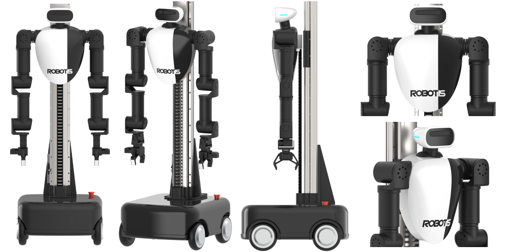
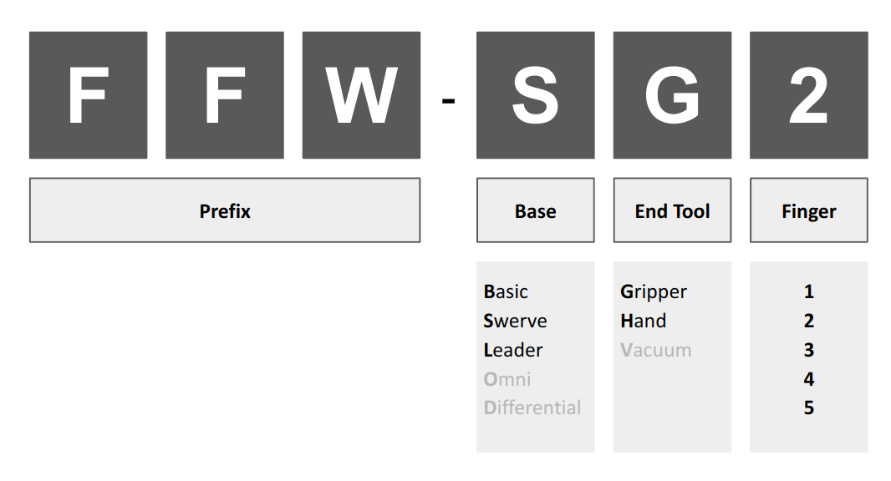
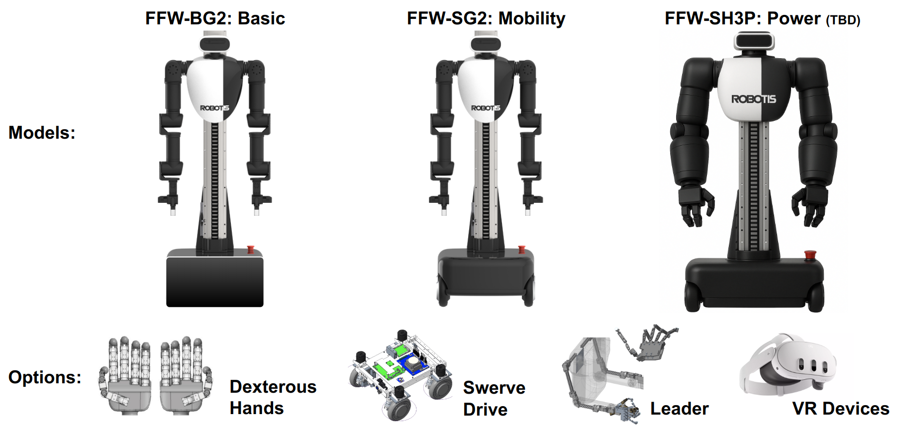
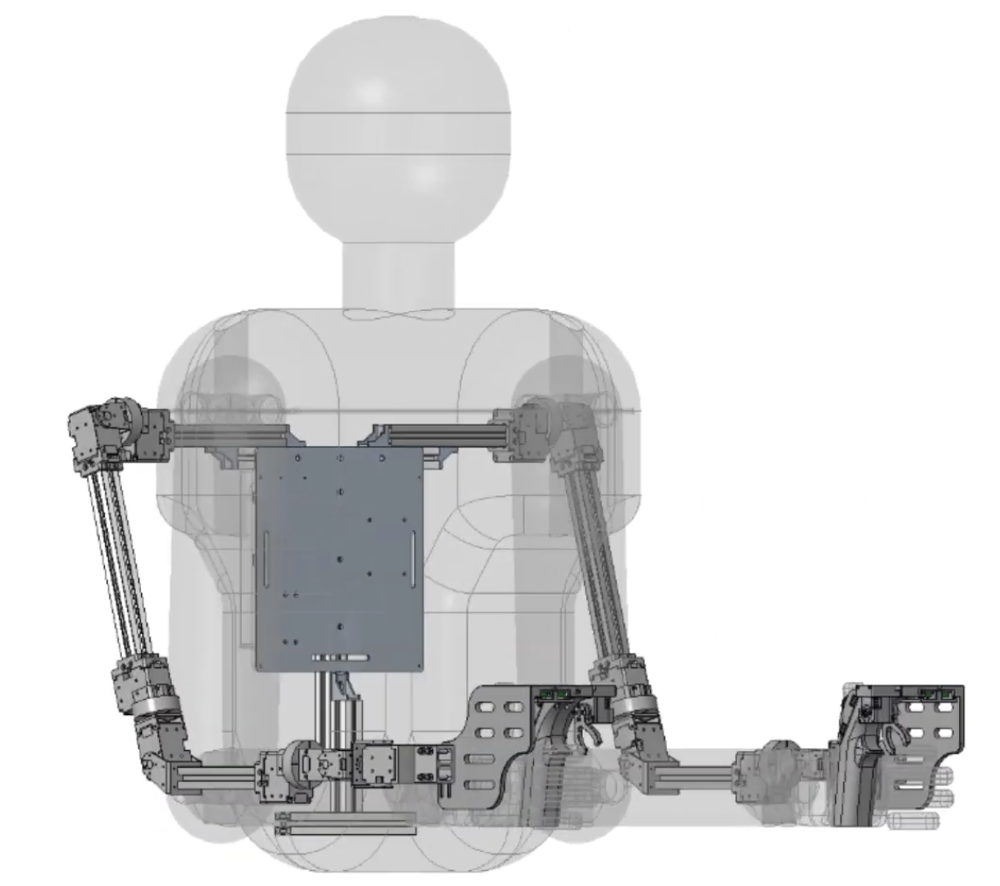
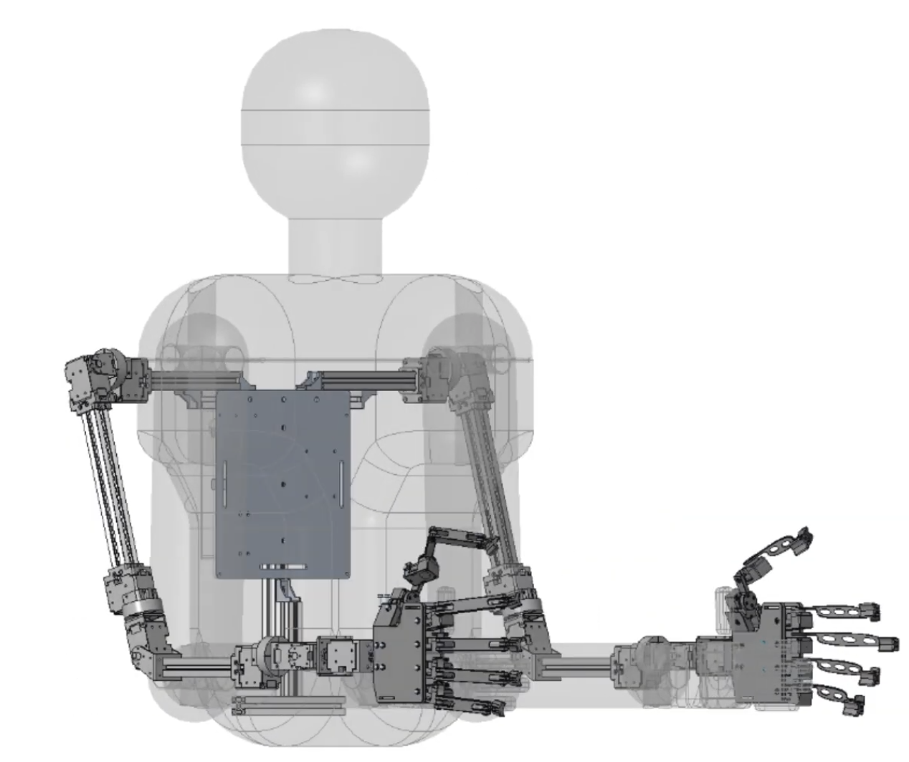
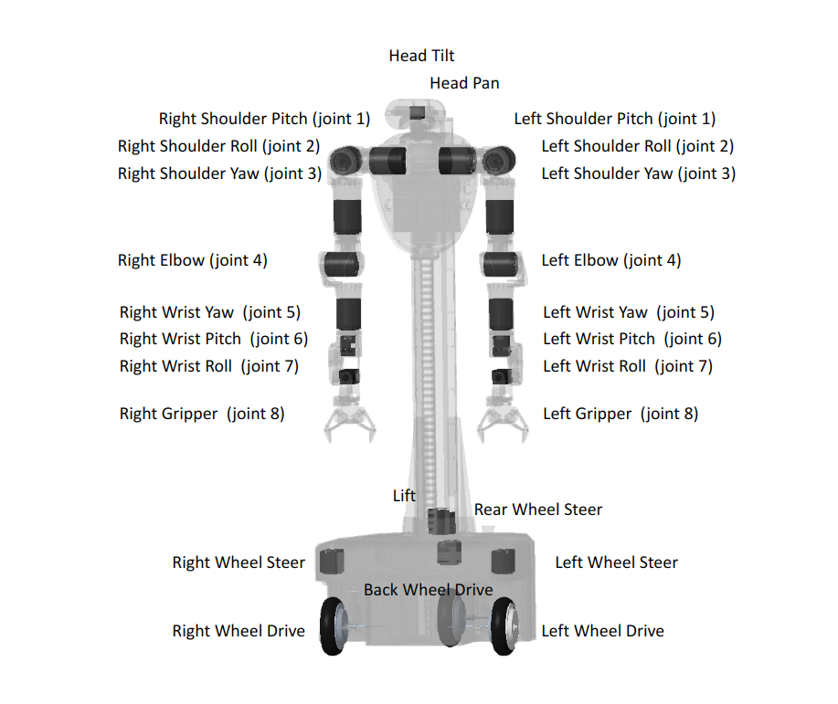
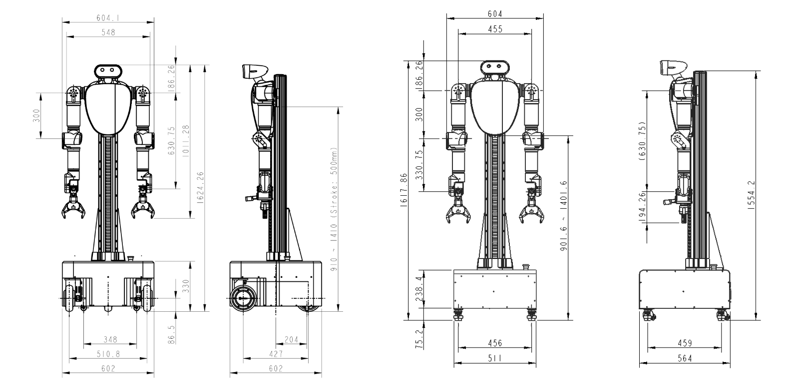

# Hardware

## Hardware Overview
The AI Worker hardware platform combines advanced robotics with AI-powered capabilities to create a versatile semi-humanoid robot. Built around ROBOTIS [DYNAMIXEL](https://dynamixel.com/) actuators, it features a mobile base with swerve drive, dual 7-DOF arms with dexterous hand/grippers, and a sensor suite that includes RGBD cameras and LiDARs. The system is powered by an NVIDIA Jetson AGX Orin computer and offers up to 4 hours of operation time on a single charge. This comprehensive hardware design enables the AI Worker to perform complex manipulation tasks through imitation learning and reinforcement learning in various industrial environments.

## Product Models

## Follower Specification

::: info
The FFW-BG2 model is scheduled for release in July 2025, while the FFW-SG2 model is expected to be released in September 2025. Please note that the specifications provided below are preliminary and subject to change before the official product launch.
:::

| Properties                  | Specification (FFW-SG2)                | Specification (FFW-BG2)                |
|-----------------------------|----------------------------------------|----------------------------------------|
| Dimensions                  | 600 x 600 x 1,600 (WxDxH, mm) 23.6 x 23.6 x 63.0 (WxDxH, inches)| TBD (WxDxH, mm) TBD (WxDxH, inches)|
| Weight                      | 85 kg (190 lbs)                         | TBD kg (TBD lbs)                      |
| Actuator                    | Arm Joint 1~5: DYNAMIXEL-Y Arm Joint 6: DYNAMIXEL-X Arm Joint 7: DYNAMIXEL-P Neck: DYNAMIXEL-X Lift: DYNAMIXEL-Y (see [DYNAMIXEL Details](#dynamixel-details))|Arm Joint 1~5: DYNAMIXEL-Y Arm Joint 6: DYNAMIXEL-X Arm Joint 7: DYNAMIXEL-P Neck: DYNAMIXEL-X Lift: DYNAMIXEL-Y (see [DYNAMIXEL Details](#dynamixel-details))|
| Degrees of Freedom          | - Total: 25 DOF - Arm: 7 DOF x 2 - Gripper: 1 DOF x 2 - Head: 2 DOF x 1 - Lift: 1 DOF x 1 - Mobile: 6 DOF | - Total: 19 DOF - Arm: 7 DOF x 2 - Gripper: 1 DOF x 2 - Head: 2 DOF x 1 - Lift: 1 DOF x 1 |
| Arm Reach                   | 647 mm (without Hand)                   | 647 mm (without Hand)                  |
| Arm Payload                 | 1.5 kg (without Hand)                   | 1.5 kg (without Hand)                  |
| Joint Resolution            | -π(rad) ~ π(rad), -262,144 ~ 262,144 (pulse/rev)| -π(rad) ~ π(rad), -262,144 ~ 262,144 (pulse/rev)|
| Joint Range                 | Joint 1, 2 : ±xxx° Joint 3 : ±xxx° Joint 4, 5, 6, 7 : ±xxx°| Joint 1, 2 : ±xxx° Joint 3 : ±xxx° Joint 4, 5, 6, 7 : ±xxx°|
| Gripper/Hand                | RH-P12-RN (see [DYNAMIXEL Details](#dynamixel-details))| RH-P12-RN (see [DYNAMIXEL Details](#dynamixel-details))|
| Mobile Type                 | Swerve Drive                            | None                                   |
| Mobile Operation Velocity   | 1.5 m/s                                 | None                                   |
| Battery Capacity            | 25.48V / 80Ah                           | 25.48V / 80Ah                          |
| Operating time              | Up to 4 hours                           | Up to 6 hours                          |
| Ambient Operating Temperature | 0 ~ 40 ℃                              | 0 ~ 40 ℃                              |
| Exterior Materials          | Aluminum, Plastic                       | Aluminum, Plastic                      |
| Sensor                      | RGBD Camera x 3, LiDAR x 2, IMU         | RGBD Camera x 3                        |
| Host Interface              | Ethernet                                | Ethernet                               |
| Internal Communications     | RS-485                                  | RS-485                                 |
| Communication Baudrate      | 4 Mbps                                  | 4 Mbps                                 |
| Computer                    | NVIDIA Jetson AGX Orin 32GB             | NVIDIA Jetson AGX Orin 32GB            |
| Software                    | ROS 2 Support, Python, C++, Web UI      | ROS 2 Support, Python, C++, Web UI     |

## Leader Specification

    

        
FFW-LG2 Model

        

            
        

        

            
        

    

    

        
FFW-LH5 Model

        

            
        

        

            
        

    

| Properties                  | Specification (FFW-LG2)                 | Specification (FFW-LH5)                |
|-----------------------------|-----------------------------------------|----------------------------------------|
| Dimensions                  | TBD (WxDxH, mm) TBD (WxDxH, inches)  | TBD (WxDxH, mm) TBD (WxDxH, inches) |
| Weight                      | TBD kg (TBD lbs)                        | TBD kg (TBD lbs)                       |
| Actuator                    | Joint 1~7: DYNAMIXEL-X                  | Joint 1~7: DYNAMIXEL-X                 |
| Degrees of Freedom          | - Total: 22 DOF - Arm: 7 DOF x 2 - Gripper: 1 DOF x 2 - JoyStick: 3 DOF x 2 | - Total: 60 DOF - Arm: 7 DOF x 2 - Hand: 20 DOF x 2 - JoyStick: 3 DOF x 2  |
| Exterior Materials          | Aluminum, Plastic                       | Aluminum, Plastic                      |
| Internal Communications     | RS-485                                  | RS-485                                 |
| Communication Baudrate      | 4 Mbps                                  | 4 Mbps                                 |
| Software                    | ROS 2 Support, Python, C++              | ROS 2 Support, Python, C++|

## Dexterous Hand
Advanced 4 and 5 finger dexterous hands for the AI Worker are currently under development. These hands are designed for complex manipulation tasks requiring human-like dexterity. Detailed specifications and options will be published in the near future as development is completed. Please contact us for more information about upcoming dexterous hand availability.

## Joints

## DYNAMIXEL Details
The AI Worker utilizes various DYNAMIXEL actuators, each selected for specific joint applications:

| Joints         | DYNAMIXEL Model | Features |
|----------------|-----------------|----------|
| Arm joints 1~5 | DYNAMIXEL-Y     | High performance, high precision, modular design |
| Arm joint 6    | DYNAMIXEL-X     | Versatile, various functions and lineup, compact design |
| Arm joint 7    | DYNAMIXEL-P     | High power, high durability, high precision |
| Head           | DYNAMIXEL-X     | Versatile, various functions and lineup, compact design |
| Lift           | DYNAMIXEL-Y     | High performance, high precision, modular design |
| Gripper        | [RH-P12-RN](https://emanual.robotis.com/docs/en/platform/rh_p12_rn/)       | Specialized gripper actuator |
| Hand           | DYNAMIXEL-X     | Specialized finger actuator |
| Mobile base    | DYNAMIXEL-Y     | High performance, high precision, modular design |

For detailed specifications of each DYNAMIXEL model, please visit the [ROBOTIS DYNAMIXEL website](https://dynamixel.com/).

## Dimension

## Workspace

(TBD)
