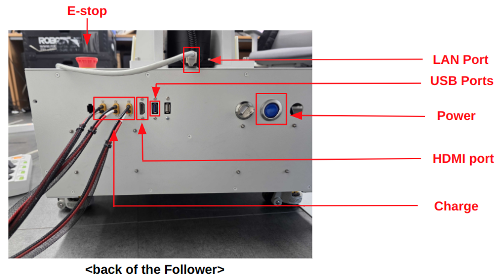
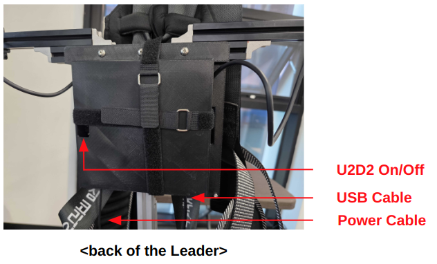

# Hardware Setup
## Follower

1. Connect all three battery charging cables to the charging terminals on the back of the `Follower`.
2. Connect the `Follower`'s HDMI port to a monitor.
3. If you need internet access, connect a LAN cable to the LAN port.
4. Press and hold the Power button on the back of the `Follower` for about 3 seconds to turn on the board.
5. After you hear a beep, check that the monitor displays the screen.

## Leader


1. Connect the USB cable to the rear USB port of the `Follower`.
2. Plug the power cable into an electrical outlet.
3. The U2D2 switch is inside a hole. Slide the switch toward the white dot to turn on the U2D2.


---

# Software Setup
## Prerequisites
- Ubuntu environment
- [Docker Engine](https://docs.docker.com/engine/install/)
- Git
- NVIDIA Container Toolkit (Install the graphics driver `nvidia-driver-570-server-open` for CUDA 12.8)

## Configuration
### 1. USB Serial Setup
1. Prepare the provided serial data.
2. Create a udev rule:
  ```bash
  sudo nano /etc/udev/rules.d/99-ai-worker.rules
  ```
3. Paste the prepared serial data into the file.
4. Save the file and exit the editor.
5. Reload udev rules and trigger:
  ```bash
  sudo udevadm control --reload
  sudo udevadm trigger
  ```


### 2. Docker Setup
- Create workspace and clone repository:
```bash
cd ~/ # specify desired path
git clone -b jazzy https://github.com/ROBOTIS-GIT/ai_worker.git
```

- Build and run Docker container:
``` bash
cd ai_worker
./docker/container.sh start without_gz # Docker build
```
```bash
./docker/container.sh enter # Enter the running Docker container
```


## Docker Command Guide

This script (`container.sh`) helps you easily manage Docker containers, including starting, entering, and stopping them.

### Usage

```bash
./container.sh [command] [options]
```

#### Commands

- `help`  
  Displays this help message.

- `start [with_gz|without_gz]`  
  Starts the container with or without Gazebo support.  
  - `with_gz`: Includes Gazebo support  
  - `without_gz`: Excludes Gazebo support

- `enter`  
  Enters the running container.

- `stop`  
  Stops the container.

#### Examples

```bash
./container.sh help                 # Show this help message
./container.sh start with_gz        # Start container with Gazebo support
./container.sh start without_gz     # Start container without Gazebo support
./container.sh enter                # Enter the running container
./container.sh stop                 # Stop the container
```

