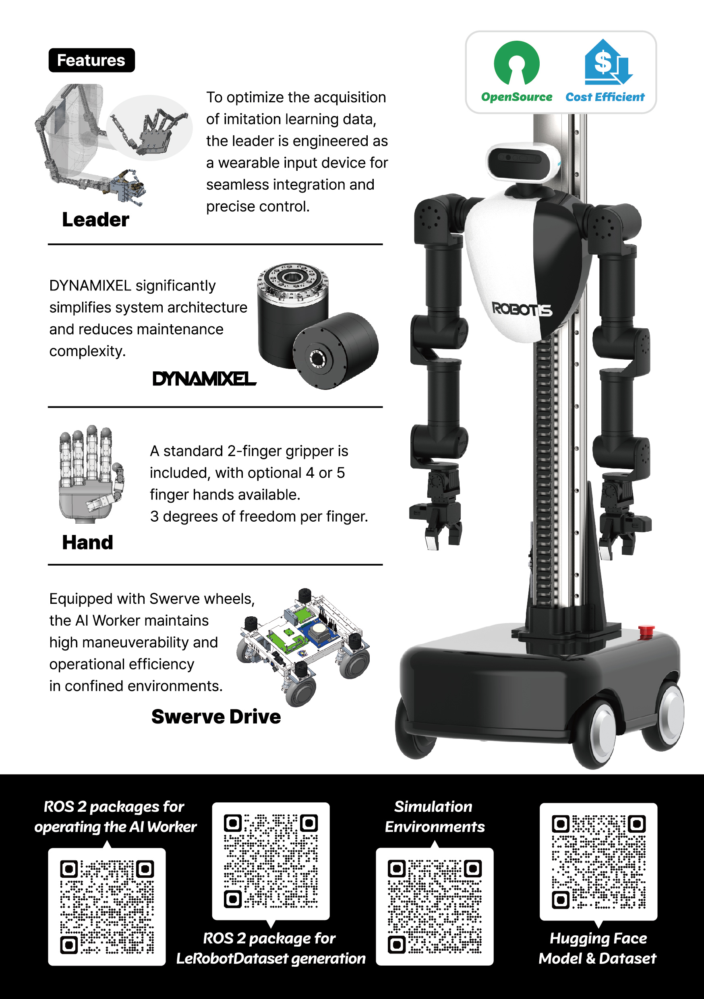

# Introduction

The ROBOTIS AI Worker is a cutting-edge semi-humanoid robot powered by physical AI. Designed to seamlessly integrate into industrial environments, it learns from human demonstrations and refines its skills through imitation learning and reinforcement learning. This innovative robot excels at performing intricate tasks like wiring harness assembly, welding, and inspection, offering a powerful solution to boost productivity and overcome labor shortages. Featuring a mobile base, dual arms, and utilizing ROBOTIS' core technologies, the AI Worker delivers high performance and reliability with an intuitive user interface. Get ready for a new era of intelligent automation!

# Introduction Video

<YouTube videoId="DX7DEf9s3Eg" />

# Introduction Brochures

