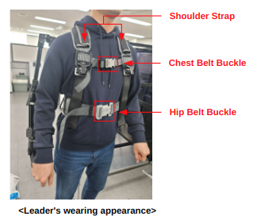

# Teleoperation
- Place the `Follower` in a spacious area.
- Wear the `Leader` device.





###### How to wear the `Leader` :
1. Put both arms through the `Leader`'s `shoulder straps`.
2. Fasten the chest belt buckle and `hip belt buckle`.
3. Adjust the length of the `shoulder straps`, `chest belt`, and `hip belt` so that the `Leader` is securely fixed on your back.
4. Face the `red sticker` attached to the `Leader` to set the initial position.

### Running Teleoperation

1. Open a new terminal and run the following command:

- To start teleoperation, run the launch file:
    ```bash
    ros2 launch ffw_bringup bringup.launch.py
    ```
    or
    ```bash
    bringup
    ```

### Important Notes

⚠️ **Camera Initialization Time**
- After launching the system, wait approximately 30 seconds before starting teleoperation
- This delay is necessary for the camera system to fully initialize
- The system will be ready for operation when the camera feed appears stable
- Do not attempt to control the robot during this initialization period

- If you want to run the `Leader` and `Follower` separately in different terminals:
    1. To launch the teleoperation `Leader`:
         ```bash
         ros2 launch ffw_bringup leader.launch.py
         ```
         or
         ``` bash
         leader
         ```
    2. To launch the teleoperation `Follower`:
         ```bash
         ros2 launch ffw_bringup follower_with_camera.launch.py
         ```
         or
         ``` bash
         follower
         ```
