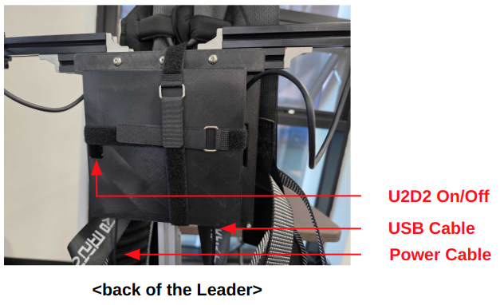

# AI Worker Setup Guide

## Table of Contents
1. [Hardware Setup](#hardware-setup)
   - [Follower Setup](#follower)
   - [Leader Setup](#leader)
2. [Software Setup](#software-setup)
   - [Prerequisites](#prerequisites)
   - [Configuration](#configuration)
3. [Docker Environment](#docker-environment)
   - [Volume Management](#volume-management)
   - [Container Management](#container-management)

---

# Hardware Setup

## Follower


### Setup Steps
1. **Power Connection**
   - Connect all three battery charging cables to the charging terminals on the back of the `Follower`
   - Press and hold the Power button for about 3 seconds to turn on the board
   - Wait for the startup beep

2. **Display Setup**
   - Connect the `Follower`'s HDMI port to a monitor
   - Verify the display shows the system screen after startup

3. **Network Setup** (Optional)
   - For internet access, connect a LAN cable to the LAN port

## Leader


### Setup Steps
1. **USB Connection**
   - Connect the USB cable to the rear USB port of the `Follower`

2. **Power Setup**
   - Plug the power cable into an electrical outlet

3. **U2D2 Activation**
   - Locate the U2D2 switch inside the hole
   - Slide the switch toward the white dot to turn on the U2D2

---

# Software Setup

## Prerequisites
- **Operating System**: Ubuntu environment
- **Container Engine**: [Docker Engine](https://docs.docker.com/engine/install/)
- **Version Control**: Git
- **Graphics Support**:
  - NVIDIA Graphics Driver (nvidia-driver-570-server-open for CUDA 12.8)
  - [NVIDIA Container Toolkit](https://docs.nvidia.com/datacenter/cloud-native/container-toolkit/latest/install-guide.html)

## Configuration

### 1. USB Serial Setup
1. **Prepare Configuration**
   - Obtain the provided serial data
   - Create a new udev rule file:
     ```bash
     sudo nano /etc/udev/rules.d/99-ai-worker.rules
     ```
   - Paste the serial data into the file
   - Save and exit the editor

2. **Apply Configuration**
   ```bash
   sudo udevadm control --reload
   sudo udevadm trigger
   ```

### 2. Docker Environment

#### Volume Management
The Docker container uses the following volume mappings for data persistence and hardware access:

```yaml
volumes:
  # Hardware and System Access
  - /dev:/dev                    # Hardware device access
  - /tmp/.X11-unix:/tmp/.X11-unix:rw  # X11 display
  - /tmp/.docker.xauth:/tmp/.docker.xauth:rw  # X11 authentication

  # Development and Data Storage
  - ./workspace:/workspace       # Main workspace directory
  - ../:/root/ros2_ws/src/ai_worker/  # AI Worker source code
  - ./lerobot/outputs:/root/ros2_ws/src/physical_ai_tools/lerobot/outputs  # Model outputs
  - ./huggingface:/root/.cache/huggingface  # Hugging Face cache
```

⚠️ **Important: Data Persistence**
- Container data is volatile and will be lost when the container is removed
- Always store important data in the mapped volumes:
  1. Use `/workspace` for development files
  2. Save model outputs to the mapped output directory
  3. Keep source code changes in the mapped ai_worker directory
  4. Store downloaded models in the huggingface cache

#### Container Management

1. **Initial Setup**
   ```bash
   # Clone the repository
   cd ~/  # or your preferred directory
   git clone -b jazzy https://github.com/ROBOTIS-GIT/ai_worker.git
   cd ai_worker
   ```

2. **Container Operations**
   ```bash
   # Start container (without Gazebo)
   ./docker/container.sh start without_gz

   # Enter running container
   ./docker/container.sh enter

   # Stop container
   ./docker/container.sh stop
   ```

## Docker Command Guide

The `container.sh` script provides easy container management:

### Available Commands
- `help`: Display help message
- `start [with_gz|without_gz]`: Start container
  - `with_gz`: Include Gazebo support
  - `without_gz`: Exclude Gazebo support
- `enter`: Enter running container
- `stop`: Stop container

### Usage Examples
```bash
./container.sh help                 # Show help
./container.sh start with_gz        # Start with Gazebo
./container.sh start without_gz     # Start without Gazebo
./container.sh enter                # Enter container
./container.sh stop                 # Stop container
```
