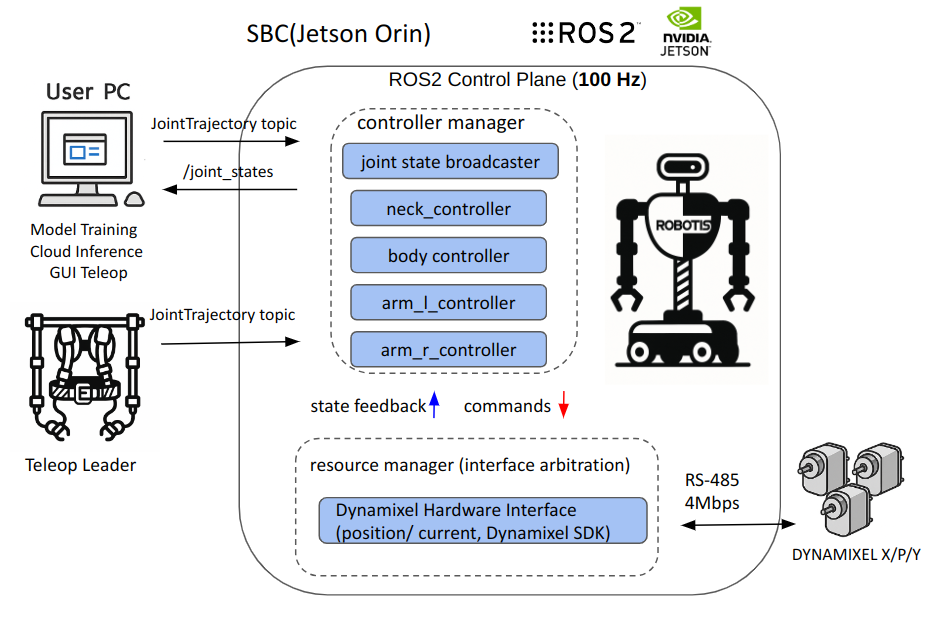

# Software

## Introduction

**AI WORKER** is a Jetson Orin–based robot platform built for real-world **Physical AI** research. It supports **full-body motion control** and enables smooth integration of both **teleoperation** and **AI policy execution**.

The platform runs on **ROS 2 Jazzy** and uses the **`ros2_control`** framework for real-time joint-level control. All joints are powered by **DYNAMIXEL X, Y, and P series** motors connected via a single RS-485 bus, using the **Dynamixel SDK**. Each joint can operate in either **position** or **current** control mode, managed through a unified hardware interface.

This platform is designed for:

- Collecting motion data through teleoperation
- Training reinforcement learning or imitation learning models
- Running AI-generated trajectories in real time without changing system code

It is suitable for researchers, developers, and integrators working with AI-enabled robotics.

## System Architecture Overview

> The diagram below illustrates the overall control structure of AI WORKER.
>
>
> External teleoperation or trajectory commands are received via ROS 2 topics, processed in real time by `ros2_control`, and executed by DYNAMIXEL actuators over RS‑485.
>



| Layer | Component | Description |
| --- | --- | --- |
| **Compute** | NVIDIA Jetson AGX Orin 32GB | Jetpack 6.2 + Docker container (ROS 2 Jazzy) |
| **Motion Control** | `ros2_control`  | 100Hz joint control loop |
| **Actuators** | DYNAMIXEL X / P / Y series | Position / Current mode via RS‑485 |
| **Communication** | U2D2 (RS‑485) | 4 Mbps, Dynamixel Protocol 2.0 |
| **Networking** | Ethernet / Wi-Fi 6 | Remote control and AI policy streaming |
| **Sensors (Optional)** | Realsense D405 (wrist), ZED Mini (head) | Integrated via official ROS 2 drivers |

## Why `ros2_control`?

`ros2_control` is a real-time, modular control framework used in ROS 2. AI WORKER uses it without major changes.

- Separates control logic from hardware drivers
- Operates at a fixed **100Hz** update rate
- Supports dynamic loading or replacement of controllers
- Allows AI policies to send trajectory commands using standard ROS topics

This structure supports both manual operation and AI-based control in the same system.

## Motion Execution Pipeline

```
Input Source (Teleoperation / AI Policy)
      ↓
ROS 2 JointTrajectory Topic
      ↓
controller_manager (100Hz)
      ↓
JointTrajectoryController(s)
      ↓
resource_manager (interface arbitration)
      ↓
DynamixelHardwareInterface (position / current)
      ↓
RS‑485 via Dynamixel SDK
      ↓
DYNAMIXEL Actuators

```

### Step-by-Step

1. **Trajectory generation** — Created by joystick, GUI, or AI model
2. **ROS topic publishing** — Commands sent to `/leader/joint_trajectory_command_broadcaster_*`
3. **Controller manager** — Runs the main `read → update → write` loop at 100Hz
4. **JointTrajectoryController** — Splits trajectory and commands each joint
5. **Resource manager** — Controls access to command interfaces and prevents conflicts between controllers
6. **Hardware interface** — Converts commands to RS-485 packets using **Dynamixel SDK**
7. **Actuators** — Execute the motion and return position/current feedback

## Controller Configuration & Joint Mapping

| Controller | Segment | DOF | Input Topic |
| --- | --- | --- | --- |
| `arm_l_controller` | Left arm (w/ gripper) | 8 | `/leader/joint_trajectory_command_broadcaster_left` |
| `arm_r_controller` | Right arm (w/ gripper) | 8 | `/leader/joint_trajectory_command_broadcaster_right` |
| `neck_controller` | Head (pan/tilt) | 2 | `/leader/joystick_controller_left` |
| `body_controller` | Vertical lift | 1 | `/leader/joystick_controller_right` |
| `joint_state_broadcaster` | All joints | – | Publishes to `/joint_states` |

All controllers (except `joint_state_broadcaster`) use the **`JointTrajectoryController`** type.

By default, all joints operate in **position mode**.

The last joint in each arm controller corresponds to the **gripper**.

## Controller YAML Example ([link](https://github.com/ROBOTIS-GIT/ai_worker/blob/main/ffw_bringup/config/follower_with_rh_hardware_controller.yaml))

```yaml
controller_manager:
  ros__parameters:
    update_rate: 100
    arm_l_controller:
      type: joint_trajectory_controller/JointTrajectoryController
    arm_r_controller:
      type: joint_trajectory_controller/JointTrajectoryController
    neck_controller:
      type: joint_trajectory_controller/JointTrajectoryController
    body_controller:
      type: joint_trajectory_controller/JointTrajectoryController
    joint_state_broadcaster:
      type: joint_state_broadcaster/JointStateBroadcaster

arm_l_controller:
  ros__parameters:
    joints:
      - arm_l_joint1
      - arm_l_joint2
      - arm_l_joint3
      - arm_l_joint4
      - arm_l_joint5
      - arm_l_joint6
      - arm_l_joint7
      - l_rh_r1_joint  # left gripper
    command_interfaces: [position]
    state_interfaces: [position, velocity]
    allow_nonzero_velocity_at_trajectory_end: true

```

## Debugging & Visualization Tools

| Tool / Topic | Description |
| --- | --- |
| `ros2 control list_controllers` | List loaded controllers and their status |
| `/joint_states` | Real-time joint position and velocity feedback |
| RViz2 | 3D view of robot model (URDF), TF, and movement |

## Safety & Fault Handling

- Joint limits are enforced using the URDF and controller configuration
- Out-of-range values are clamped by the hardware interface (YAML-defined limits)
- The Dynamixel hardware interface checks for communication errors with each motor
